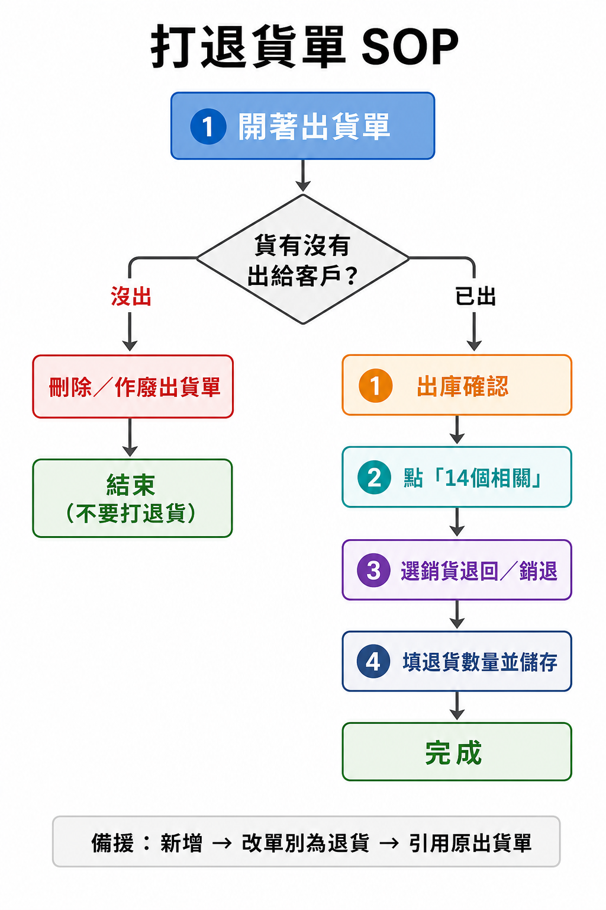

# 打退貨單 SOP

## 流程圖

## SOP（照做）

1. 開著出貨單  
2. 問自己：**貨有沒有出給客戶？**
   - **沒出** → 刪除／作廢出貨單 → 結束（不要打退貨）
   - **已出** → 繼續下面 4 步
3. 出庫確認  
4. 點「14個相關」  
5. 選「銷貨退回／銷退」  
6. 填退貨數量 → 儲存 → 完成  

**備援（相關裡沒有銷退時）：** 新增 → 改單別為退貨 → 引用原出貨單 → 填數量儲存

## 這張單的提醒

- 單號 `2608050006` 目前是 **未出庫確認**
- 若貨還沒出：走左邊（刪單），不要硬打退貨

## 相關

- 場次：[sessions/2026-08-07-erp-return-order.md](../sessions/2026-08-07-erp-return-order.md)
